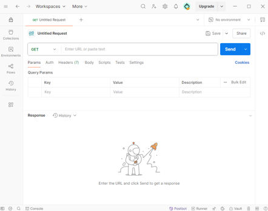
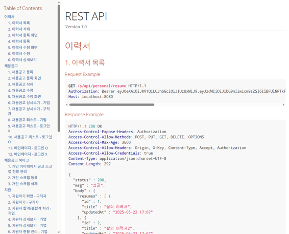
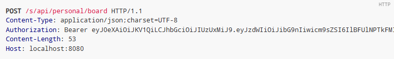
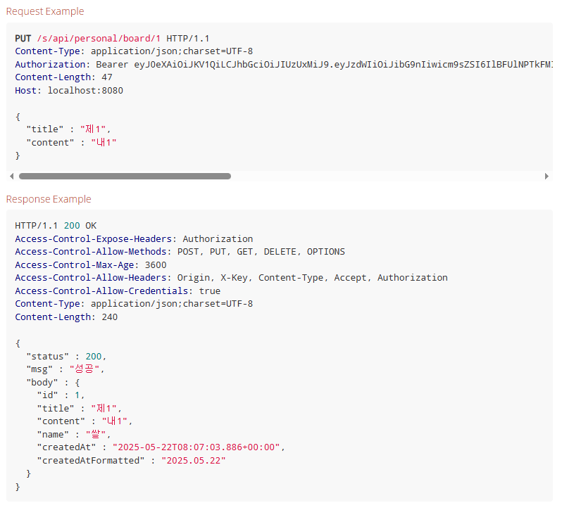
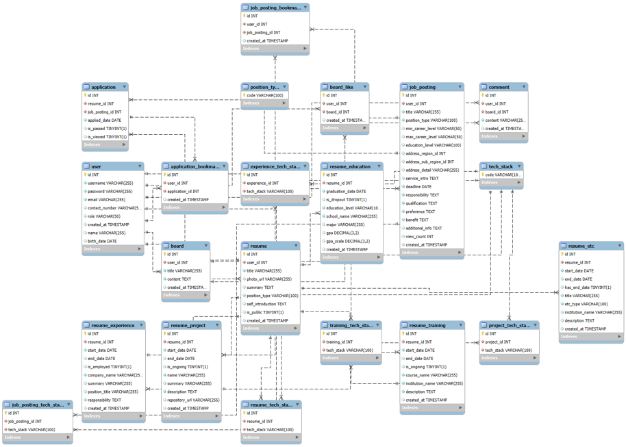

# 스프링 부트 미니프로젝트2 - 휴먼클라우드 RestAPI 앱 서버


## 스프링 부트 휴먼클라우드 RestAPI 앱 서버 프로젝트 시연영상

### 개인 & 기업

[](https://www.notion.so/getinthere/1d58a08b6c0d810e904dfacc6574712c?pvs=4#1e78a08b6c0d8007b60bd09358cb48ae)

https://www.notion.so/getinthere/1d58a08b6c0d810e904dfacc6574712c?pvs=4#1e78a08b6c0d8007b60bd09358cb48ae

## 🛠️기술스택

### 💻Backend

 
 


### 🛢DataBase


### 🔐 보안 / 인증


### 📦 ORM / JPA


### 🌐 API / 문서화


### 🧪 테스트


### ☁ 협업 도구

 


## 📡 REST API 문서

<table>
  <tr>
    <td><b>- API 문서</b></td>
    <td></td>
  </tr>
  <tr>
    <td><b>- API 인증/인가 흐름 정리</b></td>
    <td></td>
  </tr>
  <tr>
    <td><b>- Request & Response 예시</b></td>
    <td></td>
  </tr>
</table>

## 📋 테이블 쿼리



```sql
create database leapitdb;

use leapitdb;

SET FOREIGN_KEY_CHECKS = 0;
drop table if exists application_tb;
drop table if exists board_tb;
drop table if exists company_info_tb;
drop table if exists education_tb;
drop table if exists etc_tb;
drop table if exists experience_tb;
drop table if exists experience_tech_stack_tb;
drop table if exists job_posting_bookmark_tb;
drop table if exists job_posting_tb;
drop table if exists job_posting_tech_stack_tb;
drop table if exists like_tb;
drop table if exists link_tb;
drop table if exists position_type_tb;
drop table if exists project_tb;
drop table if exists project_tech_stack_tb;
drop table if exists region_tb;
drop table if exists reply_tb;
drop table if exists resume_tb;
drop table if exists resume_tech_stack_tb;
drop table if exists sub_region_tb;
drop table if exists tech_stack_tb;
drop table if exists training_tb;
drop table if exists training_tech_stack_tb;
drop table if exists user_tb;

create table application_tb (
applied_date date,
id INT AUTO_INCREMENT,
job_posting_id integer,
resume_id integer,
bookmark enum ('BOOKMARKED','NOT_BOOKMARKED') not null,
pass_status enum ('FAIL','PASS','WAITING') not null,
view_status enum ('UNVIEWED','VIEWED') not null,
primary key (id)
);

create table board_tb (
    id INT AUTO_INCREMENT,
    user_id integer,
    created_at timestamp(6),
    content varchar(255),
    title varchar(255),
    primary key (id)
);

create table company_info_tb (
    establishment_date date,
    id INT AUTO_INCREMENT,
    user_id integer,
    address varchar(255) not null,
    company_name varchar(255) not null,
    image varchar(255) not null,
    logo_image varchar(255),
    benefit TEXT,
    introduction TEXT,
    main_service TEXT,
    primary key (id)
);

create table education_tb (
    gpa numeric(3,2),
    gpa_scale numeric(2,1),
    graduation_date date,
    id INT AUTO_INCREMENT,
    is_dropout TINYINT(1),
    resume_id integer not null,
    created_at timestamp(6),
    major varchar(255),
    school_name varchar(255) not null,
    education_level enum ('ASSOCIATE','BACHELOR','DOCTOR','HIGH_SCHOOL','MASTER','NO_PREFERENCE') not null,
    primary key (id)
);

create table etc_tb (
    end_date date,
    has_end_date TINYINT(1),
    id INT AUTO_INCREMENT,
    resume_id integer not null,
    start_date date,
    created_at timestamp(6),
    institution_name varchar(255),
    title varchar(255),
    description TEXT,
    etc_type enum ('AWARD','CERTIFICATE','LANGUAGE','OTHER'),
    primary key (id)
);

create table experience_tb (
    end_date date,
    id INT AUTO_INCREMENT,
    is_employed TINYINT(1),
    resume_id integer not null,
    start_date date,
    created_at timestamp(6),
    company_name varchar(255) not null,
    position varchar(255),
    summary varchar(255),
    responsibility TEXT,
    primary key (id)
);

create table experience_tech_stack_tb (
    experience_id integer,
    id INT AUTO_INCREMENT,
    tech_stack varchar(255) not null,
    primary key (id)
);

create table job_posting_bookmark_tb (
    id INT AUTO_INCREMENT,
    job_posting_id integer,
    user_id integer,
    created_at timestamp(6),
    primary key (id)
);

create table job_posting_tb (
    address_region_id integer,
    address_sub_region_id integer,
    deadline date not null,
    id INT AUTO_INCREMENT,
    max_career_level tinyint not null check (max_career_level between 0 and 10),
    min_career_level tinyint not null check (min_career_level between 0 and 10),
    user_id integer not null,
    view_count integer default 0 not null,
    created_at timestamp(6),
    address_detail varchar(255),
    position_type varchar(255) not null,
    title varchar(255) not null,
    additional_info TEXT,
    benefit TEXT,
    education_level enum ('ASSOCIATE','BACHELOR','DOCTOR','HIGH_SCHOOL','MASTER','NO_PREFERENCE') not null,
    preference TEXT,
    qualification TEXT not null,
    responsibility TEXT not null,
    service_intro TEXT,
    primary key (id)
);

create table job_posting_tech_stack_tb (
    id INT AUTO_INCREMENT,
    job_posting_id integer,
    tech_stack varchar(255) not null,
    primary key (id)
);

create table like_tb (
    board_id integer,
    id INT AUTO_INCREMENT,
    user_id integer,
    created_at timestamp(6),
    primary key (id),
    unique (user_id, board_id)
);

create table link_tb (
    id INT AUTO_INCREMENT,
    resume_id integer not null,
    title varchar(255) not null,
    url varchar(255) not null,
    primary key (id)
);

create table position_type_tb (
    code varchar(255) not null,
    primary key (code)
);

create table project_tb (
    end_date date,
    id INT AUTO_INCREMENT,
    is_ongoing TINYINT(1),
    resume_id integer not null,
    start_date date,
    created_at timestamp(6),
    repository_url varchar(255),
    summary varchar(255),
    title varchar(255) not null,
    description TEXT,
    primary key (id)
);

create table project_tech_stack_tb (
    id INT AUTO_INCREMENT,
    project_id integer,
    tech_stack varchar(255) not null,
    primary key (id)
);

create table region_tb (
    id INT AUTO_INCREMENT,
    name varchar(255) not null,
    primary key (id)
);

create table reply_tb (
    board_id integer,
    id INT AUTO_INCREMENT,
    user_id integer,
    created_at timestamp(6),
    content varchar(255),
    primary key (id)
);

create table resume_tb (
    id INT AUTO_INCREMENT,
    user_id integer,
    created_at timestamp(6),
    updated_at timestamp(6),
    photo_url varchar(255),
    position_type varchar(255) not null,
    title varchar(255) not null,
    self_introduction TEXT,
    summary TEXT,
    primary key (id)
);

create table resume_tech_stack_tb (
    id INT AUTO_INCREMENT,
    resume_id integer not null,
    tech_stack varchar(255) not null,
    primary key (id)
);

create table sub_region_tb (
    id INT AUTO_INCREMENT,
    region_id integer,
    name varchar(255) not null,
    primary key (id)
);

create table tech_stack_tb (
    code varchar(255) not null,
    primary key (code)
);

create table training_tb (
    end_date date,
    id INT AUTO_INCREMENT,
    is_ongoing TINYINT(1),
    resume_id integer not null,
    start_date date,
    created_at timestamp(6),
    course_name varchar(255),
    institution_name varchar(255),
    description TEXT,
    primary key (id)
);

create table training_tech_stack_tb (
    id INT AUTO_INCREMENT,
    training_id integer not null,
    tech_stack varchar(255) not null,
    primary key (id)
);

create table user_tb (
    birth_date date,
    id INT AUTO_INCREMENT,
    created_at timestamp(6),
    contact_number varchar(255) not null,
    email varchar(255) not null,
    name varchar(255),
    password varchar(255) not null,
    username varchar(255) not null unique,
    role enum ('COMPANY','PERSONAL') not null,
    primary key (id)
);

ALTER TABLE application_tb
    add constraint FKpyl6mnsnev5drq2ri4697awv
    foreign key (job_posting_id)
    references job_posting_tb(id);

ALTER TABLE application_tb
    add constraint FKd8jmkjt24frnjlcyehe0hfc9r
    foreign key (resume_id)
    references resume_tb(id);

ALTER TABLE board_tb
    add constraint FKgxwryj58kh66twbp656wo5gnn
    foreign key (user_id)
    references user_tb(id);

ALTER TABLE company_info_tb
    add constraint FKo48elvxovfke4btsfa6t41t96
    foreign key (user_id)
    references user_tb(id);

ALTER TABLE education_tb
    add constraint FKl6v8vw44ery6qu4m3m6og64if
    foreign key (resume_id)
    references resume_tb(id);

ALTER TABLE etc_tb
    add constraint FKtbphcs4x7qyss5d0rvt4r7p7v
    foreign key (resume_id)
    references resume_tb(id);

ALTER TABLE experience_tb
    add constraint FKo9mtd0tq6xflvo9tujovodbje
    foreign key (resume_id)
    references resume_tb(id);

ALTER TABLE experience_tech_stack_tb
    add constraint FKcn1jjxrhja0jy7ysl6l2cvc04
    foreign key (experience_id)
    references experience_tb(id);

ALTER TABLE job_posting_bookmark_tb
    add constraint FKn1sgqti68ilhkq1igoue9xyus
    foreign key (job_posting_id)
    references job_posting_tb(id);

ALTER TABLE job_posting_bookmark_tb
    add constraint FKjy2fj3o81hq3u2oer52sxeo17
    foreign key (user_id)
    references user_tb(id);

ALTER TABLE job_posting_tb
    add constraint FKl6rbddp9wp411pddrifpex3d8
    foreign key (user_id)
    references user_tb(id);

ALTER TABLE job_posting_tech_stack_tb
    add constraint FKoo6k0xluu2pyv2kqjw3jq5bf9
    foreign key (job_posting_id)
    references job_posting_tb(id);

ALTER TABLE like_tb
    add constraint FKsa7oblwmytscifhoqugrqj63x
    foreign key (board_id)
    references board_tb(id);

ALTER TABLE like_tb
    add constraint FKcnecvfc2qfwiwnv1tb9d6eyil
    foreign key (user_id)
    references user_tb(id);

ALTER TABLE link_tb
    add constraint FKqlsighs0if4fpgvra9g9wpdom
    foreign key (resume_id)
    references resume_tb(id);

ALTER TABLE project_tb
    add constraint FK9sjba6n8n5v6vtqmqfuitfoyn
    foreign key (resume_id)
    references resume_tb(id);

ALTER TABLE project_tech_stack_tb
    add constraint FK2it4viclib5qtskayqjawudr7
    foreign key (project_id)
    references project_tb(id);

ALTER TABLE reply_tb
    add constraint FKjm6c1ap97ufy07pocvy5m64wj
    foreign key (board_id)
    references board_tb(id);

ALTER TABLE reply_tb
    add constraint FKps6o6lxgwm5loo2am532rgeuj
    foreign key (user_id)
    references user_tb(id);

ALTER TABLE resume_tb
    add constraint FKkekcuvdgq0k03cs3agthjwsu9
    foreign key (user_id)
    references user_tb(id);

ALTER TABLE resume_tech_stack_tb
    add constraint FK908l1j9inyvory759gh3o90m8
    foreign key (resume_id)
    references resume_tb(id);

ALTER TABLE sub_region_tb
    add constraint FK613pngrpyqi84h3q8nyy6jc2q
    foreign key (region_id)
    references region_tb(id);

ALTER TABLE training_tb
    add constraint FKd2atoly22xw3y1maj31yo7xbm
    foreign key (resume_id)
    references resume_tb(id);

ALTER TABLE training_tech_stack_tb
    add constraint FKphpben12vdbc3xqpou6ciih2d
    foreign key (training_id)
    references training_tb(id);
SET FOREIGN_KEY_CHECKS = 1;

```
